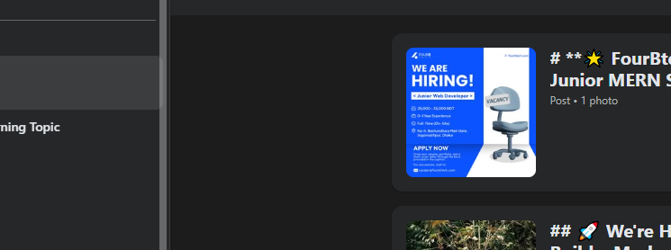

**14 May, 25**

### 1-1 Get Started With Docker

### 1-2 What is Docker & Why?

- what is docker & why ?

  - docker is a container technology. A tool for creating and managing containers.

- what is container ?
  - a standardize unit of software. A package of code and dependencies to run that code (e.g NodeJS Code + the NodeJS runtime)
  - the same container always yields the exact same application and execution behavior! No matter where or by whom it might be executed.

### 1-3 Virtual Machine vs. Docker Containers

- what is virtual machine: it is like a physical computer but it has no physical existence, work like a totally isolated machine ( suppose you have two desktop pc, between them one has windows os and another has linux. they totally run in a isolate way. These two pc has no communication. In the same way when we installed a virtual machine (which has its own virtual os) on our host operating system, this virtual machine work isolately by using its own os.)

- we can do the same task of docker by using virtual machine.

- suppose we build a project in out virtual machine, and then we share this virtual machine with our team mates, then they can run the project within the virtual machine and get the same output as mine.

- so why don't we use virtual machine as docker?

