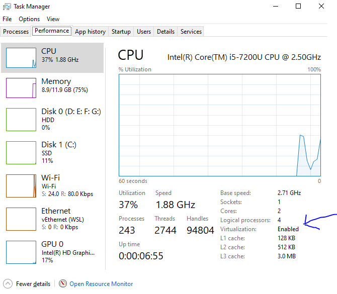
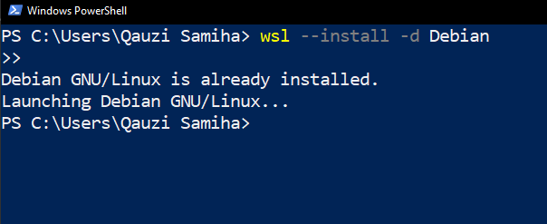
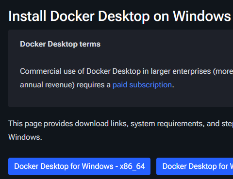
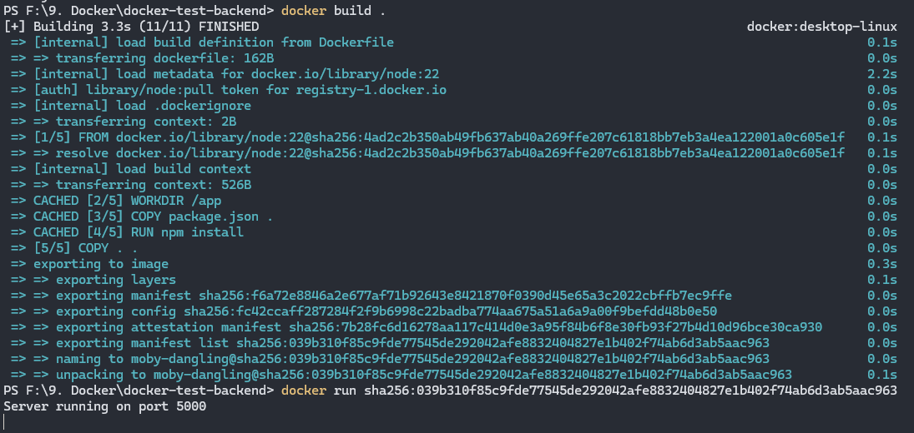
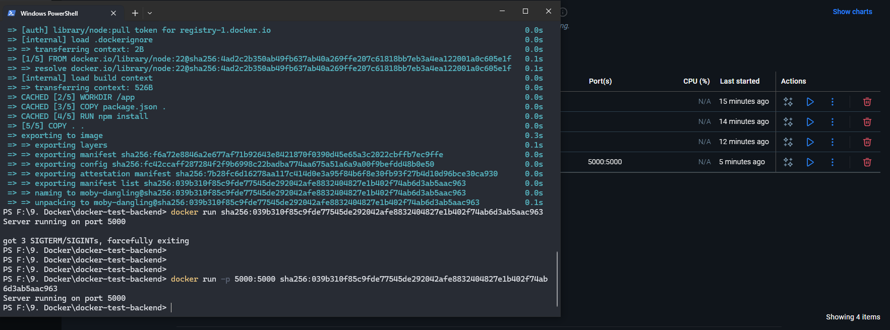

**14 May, 25 --**
**1 Oct, 25 --**
**21 Nov, 25**

## 1-1 Get Started With Docker

- [Docker Cheat Sheet 1](https://find-saminravi99.notion.site/WSL-Cheat-Sheet-10dc48b8ac8c800eb30ec02c8d0507d5)

- [Github Link - First Docker Container PH](https://github.com/Apollo-Level2-Web-Dev/first-docker-container/tree/main)

## 1-2 What is `Docker` & Why?

- What is `docker` & why do we use `docker` ?

  - Docker is a container technology. Docker is a tool for creating and managing containers.

- What is `container` ?
  - A standardize unit of software. A package of code and dependencies to run that code (e.g NodeJS Code + the NodeJS runtime)
  - The same container always yields the exact same application and execution behavior! No matter where or by whom it might be executed.

## 1-3 Virtual Machine vs. Docker Containers

- What is `Virtual Machine(VM)`: It is like a physical computer but it has no physical existence, work like a totally isolated machine ( suppOSe you have two desktop pc, between them one has windows OS and another has linux OS. They totally run in a isolate way. These two pc has no communication. In the same way when we installed a virtual machine (which has its own virtual OS) on our hOSt operating system, this virtual machine work isolately by using its own OS.)

- We can do the same task of docker by using virtual machine.

- SuppOSe we build a project in our virtual machine, and then we share this virtual machine with our team mates, then they can run the project within the virtual machine and get the same output as mine.

- So why don't we use `virtual machine` as `docker`?

  - Because we keep only one project into one virtual machine to make it isolate. So multiple projects need multiple virtual machines. So we need to keep multiple virtual machine in our host OS. After a certain time we will face storage shortage.
  - `VM` wastes a lot of space on your hard drive and tends to be slow.

- `Virtual Machine` / `Virtual OS` Pros and Cons:
  | Pros | Cons |
  |--------------------------------------|----------------------------------------------------------------------|
  | Separated environments | Redundant duplication, waste of space |
  | Environment-specific configuration | Performance can be slow, boot times can be long |
  | Environment configuration can be shared and reproduced reliably | Reproducing on another computer/server is possible but may still be tricky |

- Docker helps you to build & manage `containers`.

- Docker also (like Virtual Machine) works on OS, it has a `docker engine`, but docker doesn't installed any `virtual OS` (like VM), so the space for `OS` is totally minimized.

- `Virtual Machine` : Container with libraries, dependencies, tools, and OS.
- `Docker` : Container with libraries, dependencies, tools, but `without` OS.

- `Image` or `blueprint` - we share it.
- If we don't use any container in docker we can delete it, and by using the `image` or `blueprint` we can recreate the container again.
- But deleting an VM container and recreate it is not easy.

## 1-4 Docker Setup

- [Docker Installation](https://docs.docker.com/engine/install/)
- For Windows & MacOS:
  - If requirements met then : install docker desktop
  - If requirements not met then : install docker toolbox
- For Linux:
  - Llinux by default supports docker and docker runs in linux environment.
  - We can directly install docker engine and can use by terminal.

## 1-5 Docker Installation (Windows)

- [Install Docker Desktop on Windows
  ](https://docs.docker.com/desktop/setup/install/windows-install/)
- `WSL` -> windows subsystem for linux or hyper-v -> a way to use docker or linux natively within windows (as windows not support docker)
- WSL -> one kind of virtual machine

**17 May, 25 -- 21 Nov, 2025**

- For installing docker desktop in our windows, we need WSL or hyper-v. Docker works at linux environment. By default linux support docker. But windows does not support docker by default. However if we can create an linux environment in our windows, we can run docker in our windows.

- Search for : windows -> search for Turn `Windows feature on or off`.
- Check out `Windows Subsystem for Linux` and `Virtual Machine Platform`.


- [Microsoft Documentation](https://learn.micrOSoft.com/en-us/windows/wsl/install)

- run to powershell:

```bash
wsl --install
```

- Linux is a open source OS
- Like windows 7, 10, 11,... linux has different distribution such as `ubuntu`, `debian`
- If we run `wsl --install` then this command will install `ubutu` (default distribution of linux) as distribution.

```bash
wsl --install -d Debian
```


- Restart the PC again.
- [Enable virtualization using BIOS](https://youtu.be/_59VZMPUikc?si=A8UtAREOpsBC3lDq):
  - Check if your CPU supports virtualization
  - Press Ctrl + Shift + Esc → Task Manager
  - Look for: Virtualization: Enabled/Disabled
  - If it says Disabled → go to BIOS and enable it
  - Restart computer → press the BIOS key (usually F2 / F10 / DEL / ESC)
  - Look for settings like:
    - Intel Virtualization Technology (VT-x)
    - Enable → Save → Restart.



- Rerun:

```bash
wsl --install -d Debian
```




- Download Docker desktop on windows




- log in to docker using Github.
- To get all commands of docker:

```bash
docker --help
```

## 1-8 Overview of Docker Tools

- We must require `docker engine` to use docker.
- As windows has no linux OS support, that's why we use docker engine (virtual machine) to use docker in windows.
- If windows supports linux OS, then we won't need docker engine.
- `Docker Engine` (a virtual machine)
- `Docker Desktop` -- a GUI
- `Docker Hub` - make easy to do collaborative tasks.
- `Docker Compose` - to keep multiple container of a same project: such as container for frontend, container for backend, database, etc in a managable suite

## 1-9 Configuring VS Code & Creating The First Container

- [GitHub Link:](https://github.com/Apollo-Level2-Web-Dev/first-docker-container)

- vs code extension install: Docker


- vs code: ctrl + shift + p -- reload window
- Create `Dockerfile` within project root -- no extension required
- To create an image:

```bash
docker build .
```


- Docker Image: a blueprint to run docker container
- copy the image id
- run a container using the image id:

```bash
docker run image_id
docker run sha256:039b310f85c9fde77545de292042afe8832404827e1b402f74ab6d3ab5aac963
```



```bash
docker run -p project_port:docker_port image_id
docker run -p 5000:5000 sha256:039b310f85c9fde77545de292042afe8832404827e1b402f74ab6d3ab5aac963
```



- Container is a isolated environment, there is no relation between container and our system.


