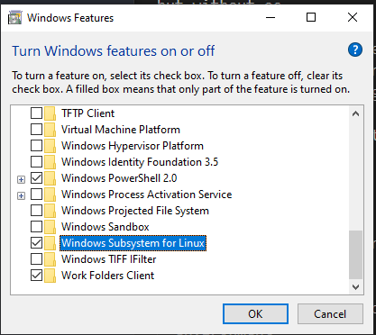
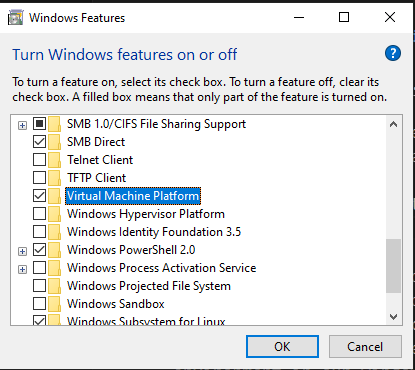
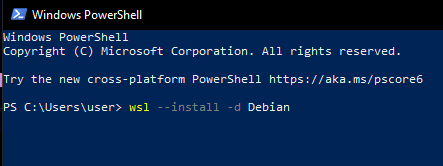
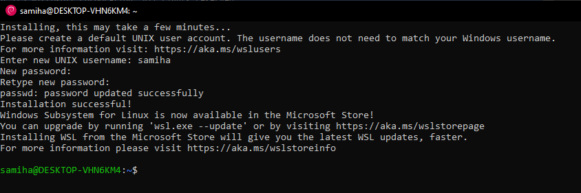
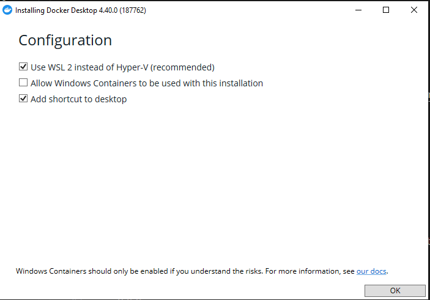
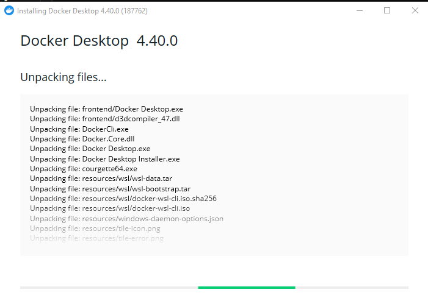
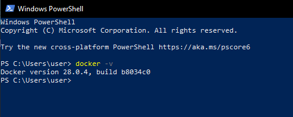
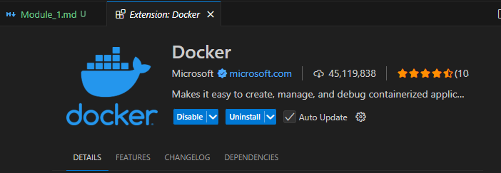
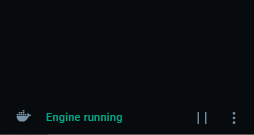
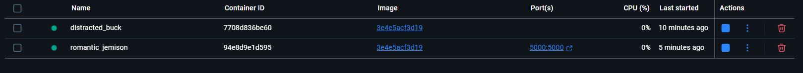

**14 May, 25**
**1 Oct**

## 1-1 Get Started With Docker

## 1-2 What is Docker & Why?

- What is docker & why ?

  - Docker is a container technology. A tool for creating and managing containers.

- What is container ?
  - A standardize unit of software. A package of code and dependencies to run that code (e.g NodeJS Code + the NodeJS runtime)
  - The same container always yields the exact same application and execution behavior! No matter where or by whom it might be executed.

## 1-3 Virtual Machine vs. Docker Containers

- What is `Virtual Machine(VM)`: It is like a physical computer but it has no physical existence, work like a totally isolated machine ( suppose you have two desktop pc, between them one has windows OS and another has linux OS. They totally run in a isolate way. These two pc has no communication. In the same way when we installed a virtual machine (which has its own virtual os) on our host operating system, this virtual machine work isolately by using its own os.)

- We can do the same task of docker by using virtual machine.

- Suppose we build a project in our virtual machine, and then we share this virtual machine with our team mates, then they can run the project within the virtual machine and get the same output as mine.

- So why don't we use `virtual machine` as `docker`?

  - Because we keep only one project into one virtual machine to make it isolate. So multiple projects need multiple virtual machines. So we need to keep multiple virtual machine in our host OS. After a certain time we will face storage shortage.
  - Wastes a lot of space on your hard drive and tends to be slow.

- `Virtual Machine / Virtual OS Pros and Cons`:
  | Pros | Cons |
  |--------------------------------------|----------------------------------------------------------------------|
  | Separated environments | Redundant duplication, waste of space |
  | Environment-specific configuration | Performance can be slow, boot times can be long |
  | Environment configuration can be shared and reproduced reliably | Reproducing on another computer/server is possible but may still be tricky |

- Docker helps you to build & manage 'containers'

- Docker also (like Virtual machine) works on OS, it has a docker engine, but docker doesn't installed any virtual os (like vm), so the space for os is totally minimized.

- virtual Machine : Container with libraries, dependencies, tools, and os.
- Docker : Container with libraries, dependencies, tools, but without OS.

- image or blueprint - we share it.
- If we don't use any container in docker we can delete it, and by using the image or blueprint we can recreate the container again.
- But deleting an vm container and recreate it is not easy.

## 1-4 Docker Setup

- For Windows & MacOS:
  - requirements met : install docker desktop
  - requirements not met : install docker toolbox
- For Linux:
  - by default support docker and docker run in linux environment
  - install docker engine

## 1-5 Docker Installation [Windows]

- [install](https://docs.docker.com/desktop/setup/install/windows-install/)
- `WSL` -> windows subsystem for linux or hyper-v -> a way to use docker or linux natively within windows (as windows not support docker)
- WSL -> one kind of virtual machine

**17 May, 25**

- For installing docker desktop in our windows, we need WSL or hyper-v. docker works at linux environment. By default linux support docker. But windows does not support docker by default. However if we can create an linux environment in our windows, we can run docker in our windows.

- search for : windows -> search for Turn `Windows feature on or off`.
- Check out `Windows Subsystem for Linux` and `Virtual Machine Platform`.





- [Microsoft Documentation](https://learn.microsoft.com/en-us/windows/wsl/install)

- run to powershell:

```bash
wsl --install
```

- Linux is a open source OS
- Like windows 7, 10, 11,... linux has different distribution such as `ubuntu`, `debian`

```bash
wsl --install -d Debian
```











## 1-8 Overview of Docker Tools

- We must require docker engine to use docker
- As windows has no linux os support, that's why we use docker engine (virtual machine) to use docker in windows.
- if windows supports linux os, then we won't need docker engine
- `Docker Engine` (a virtual machine)
- `Docker Desktop` -- a GUI
- `Docker Hub` - make easy to do collaborative tasks.
- `Docker Compose`

## 1-9 Configuring VS Code & Creating The First Container

- [GitHub Link:](https://github.com/Apollo-Level2-Web-Dev/first-docker-container)

- vs code extension install: Docker



- vs code: ctrl + shift + p -- reload window
- docker file -- no extension required
- to create image:

```bash
docker build .
```



- Docker Image: a blueprint to run docker container

```bash
docker run -p project_port:docker_port image_id
```

- Container is a isolated environment, there is no relation between container and our system.


